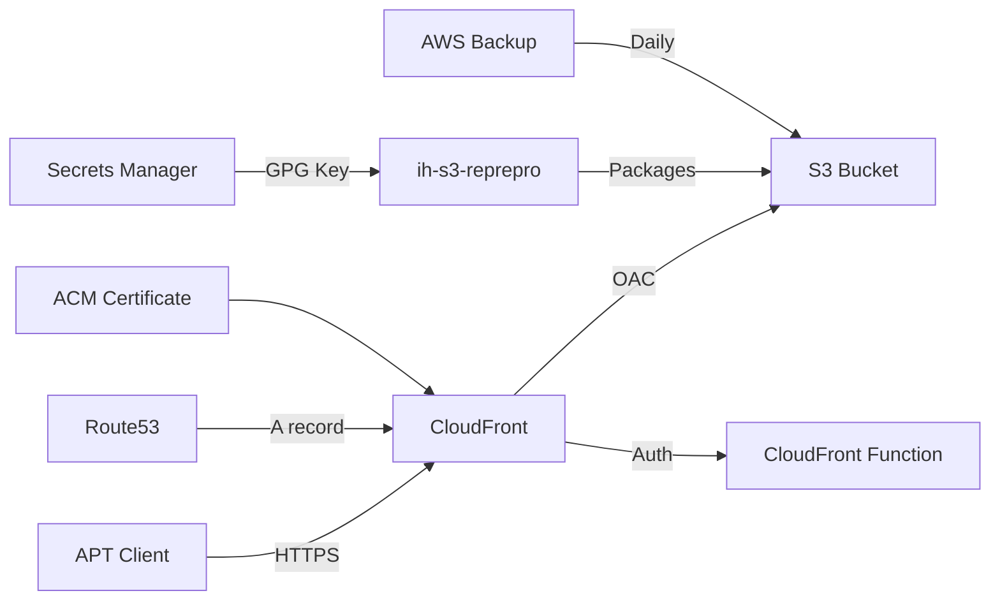

# Architecture

This document explains how the module works and how its components interact.

## Overview



## Components

### S3 Bucket (Storage)

The primary S3 bucket stores all repository content:

```
bucket/
  conf/
    distributions       # reprepro configuration
  dists/
    <codename>/         # e.g., noble/
      main/
        binary-amd64/
          Packages.gz
        Release
        InRelease
  pool/
    main/
      <package-name>/
        <package>.deb
  index.html            # Landing page
  DEB-GPG-KEY-*         # Public GPG key for clients
```

Configuration:

- Versioning enabled (protects against accidental overwrites)
- Public access blocked (all access goes through CloudFront)
- SSL-only bucket policy
- Server access logging to a separate bucket

### CloudFront (Delivery)

The CloudFront distribution provides:

- **HTTPS termination** with TLS 1.2+ (minimum protocol version `TLSv1.2_2021`)
- **Origin Access Control (OAC)** -- the bucket is not publicly accessible; only
  CloudFront can read from it
- **Caching** -- TTL of 60s min / 300s default / 600s max (appropriate for a repo
  that updates periodically)
- **Geo-restriction** -- blocks RU, CN, IR by default
- **HTTP basic auth** -- optional CloudFront Function for viewer-request authentication
- **Access logging** -- logs stored in a dedicated S3 bucket

### ACM Certificate (TLS)

- Created in `us-east-1` (CloudFront requirement)
- DNS validation via Route53 records (fully automated)
- CAA record restricts certificate issuance to Amazon

### Route53 (DNS)

- A record (ALIAS) pointing the domain to the CloudFront distribution
- CNAME records for ACM DNS validation
- CAA record for `amazon.com`

### Secrets Manager (GPG Keys)

Two secrets are created:

1. **`packager-key-<codename>`** -- stores the GPG private key (uploaded manually)
2. **`packager-passphrase-<codename>`** -- stores the passphrase (auto-generated)

Access is controlled via IAM:

- `signing_key_readers` -- roles that can read the key (e.g., CI/CD packager role)
- `signing_key_writers` -- roles that can update the key

### AWS Backup

- Daily backup of the S3 repository bucket (configurable schedule)
- Default retention: 30 days
- Encrypted with a dedicated KMS key

## Request Flow

### Package Download (APT Client)

```
1. Client resolves packages.example.com
         |
         v
2. Route53 returns CloudFront distribution domain
         |
         v
3. Client sends HTTPS request
         |
         v
4. CloudFront terminates TLS (ACM certificate)
         |
         v
5. [Optional] CloudFront Function checks HTTP basic auth
         |
         v
6. CloudFront checks cache
   - HIT: return cached response
   - MISS: fetch from S3 via OAC
         |
         v
7. S3 returns object, CloudFront caches and responds
```

### Package Upload (CI/CD)

```
1. CI/CD role assumes bucket_admin_role
         |
         v
2. ih-s3-reprepro reads GPG key from Secrets Manager
         |
         v
3. Package is signed and uploaded directly to S3
   (bypasses CloudFront -- direct S3 API access)
         |
         v
4. reprepro updates Packages.gz, Release, InRelease
         |
         v
5. CloudFront cache expires (within max_ttl of 600s)
         |
         v
6. Next client request gets fresh metadata
```

## Security Model

### Network

- No public S3 access -- all reads go through CloudFront with OAC
- HTTPS-only -- HTTP requests are not supported (viewer_protocol_policy = "https-only")
- Geo-restricted -- blocks traffic from high-risk countries
- Optional HTTP basic auth for additional access control

### IAM

- `bucket_admin_roles` -- can upload packages to S3
- `signing_key_readers` -- can read GPG private key for signing
- `signing_key_writers` -- can rotate GPG key material
- CloudFront OAC -- scoped to this specific bucket
- Backup role -- scoped to S3 backup/restore only

### Encryption

- S3: server-side encryption (SSE-S3)
- CloudFront: TLS 1.2+ in transit
- Secrets Manager: AWS-managed encryption at rest
- Backup vault: customer-managed KMS key
